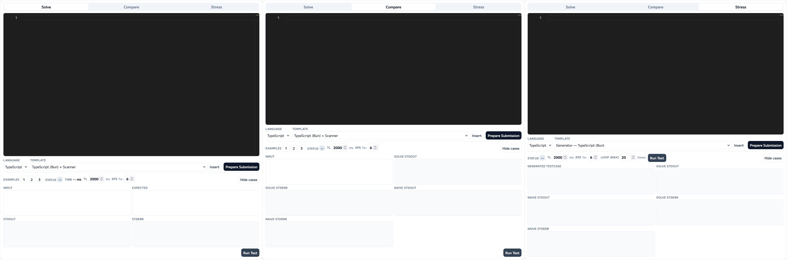

# AtCoder In-Browser Playground (AIBP)

AtCoderの問題ページに、ブラウザ上で動作が完結するコードエディター・テスターを追加するWeb拡張機能です。

## License

- copyright (c) 2026- Ayasaka-Koto.
- This project is licensed under the MIT License. See the [LICENSE](./LICENSE) file for details.

## Installation

- [Chrome Web Store](https://chromewebstore.google.com/detail/atcoder-in-browser-playgr/peebgngcbbimicflmefcmbobenpfbnok)
- [Firefox Add-ons](https://addons.mozilla.org/ja/firefox/addon/atcoder-in-browser-playground/)

### Developing

```bash
pnpm install
pnpm run dev:chrome    # Chrome Dev Build (※コードテスト実行機能が動作しない Chrome検証時は要build)
pnpm run dev:firefox   # Firefox Dev Build
pnpm run build:chrome  # Chrome Production Build
pnpm run build:firefox # Firefox Production Build
pnpm run build         # Production Build (Firefox + Chrome)
pnpm run zip:chrome    # Chrome Production Build -> Zip
pnpm run zip:firefox   # Firefox Production Build -> Zip
pnpm run zip           # Production Build -> Zip (Firefox + Chrome)
pnpm test              # Unit Test (Vitest)
pnpm run lint          # Oxlint
pnpm run fmt           # Oxfmt
pnpm run compile       # Cheking (tsc --noEmit)
```

- `wxt.config.ts`の`version`フィールドにある拡張機能のバージョンをちゃんと編集すること！
- Firefox 一時的なアドオンの読み込み: `about:debugging#/runtime/this-firefox`
- Firefox申請時 ビルド手順の伝達:
    ```
    Build command: `pnpm install` (-> `pnpm approve-builds` ) -> `pnpm run build:firefox`(or `pnpm run zip:firefox`)
    ```

## Features

1. 外部環境に依存しない、ブラウザ完結のコードテスト
    - コードの実行はブラウザ内(Web Worker)で行われます。
    - AtCoderのコードテストなどの外部環境に依存しません。
2. Monaco Editorによる高度なコード編集機能
    - Visual Studio Codeで使用されているMonaco Editorを組み込んでいます。
    - 一部言語では、Syntax HighlightやIntelliSenseなどの高度なコード編集機能を利用できます。
3. クリップボードへのコードコピーと提出準備
    - 編集したコードを問題ページ下部のソースコード入力欄に自動入力することができます。
4. 複数言語への対応
    - 複数のプログラミング言語に対応しています。

### Why AIBP?

AIBPが公開されるまで、AtCoderのコンテストに参加するためにコードを書く方法は、主に以下の2つが主流でした。

- AtCoderの「コードテスト」ページを利用する
    - ページを開けば利用できるため、手軽に使うことができます
    - しかし、VSCodeのようなIDEと比較すると機能が限定されており、コード編集環境として快適であると感じない人も少なくありません
- [oj](https://github.com/online-judge-tools/oj)等の環境構築を行い、ローカルのコードエディターを使用する
    - 使用するエディタを自由に制限できる、慣れれば提出までをスムーズに行えるなどの利点があります
    - しかし、環境構築には手間がかかり、特に初心者にとってはハードルが高いことが多いです

これら2つの方法の「間」を埋めることを目的として作られたのが、AtCoder In-Browser Playgroundです。
AIBPをあなたが使っているブラウザにインストールするだけで、AtCoderの問題ページを問題確認から提出までをより快適に行う環境に変えることができます。

### Quick Start Guide

> 
> (左: Solveタブ / 中: Compareタブ / 右: Stressタブ)

本拡張機能を導入した状態でAtCoderの問題ページを開くと、画像のようなUIをもつパネルが追加されます。

- Solveタブ (メイン)
    - エディタのすぐ下にある欄で使用する言語を選択します
        - 言語によっては、その右にある選択欄で選んだテンプレートを挿入することができます
    - 上部のエディタに提出コードを書きます
    - 「EXAMPLE」欄のボタンでテストが実行できます
    - 「Show Cases」ボタンを押すとテストケースや実行結果の詳細が見れたり、手動でテストケースを入力して実行することができます
    - 「Prepare Submission」ボタンを押すと提出欄に自動入力してくれます
- Compareタブ (愚直解との比較)
    - このタブのエディタには愚直解法(など)のコードを書きます
    - 下部のテスト実行では、CompareタブとSolveタブのコードで出力結果を比較してその結果を表示します
- Stressタブ (ランダムテスト)
    - このタブのエディタには、Solve/Compareタブのプログラムにわたす入力をstdoutに出力するコードを書きます
    - (最大)回数を指定して実行すると、Stressタブのプログラムで生成したテストケースをSolve/Compareタブのプログラムに渡した結果を比較して結果を表示します

## Supported Environment

### Browser

- 保証: Mozilla Firefox、Google Chrome
- 期待: Firefoxベースのブラウザ([Floorp](https://ja.floorp.app/ja-JP)など)、Chromiumベースの各ブラウザ([Edge](https://www.microsoft.com/ja-jp/edge)など)

### Languages

- JavaScript
    - 対象ジャッジ: JavaScript (Bun 1.2.21), JavaScript (Deno 2.4.5), JavaScript (Node.js 22.19.0)
    - 制約
        - 入力は以下のいずれかで受け付ける必要があります
            - `require("fs").readFileSync("/dev/stdin", "utf8")`
            - `await Deno.readTextFile("/dev/stdin")`
            - `await Bun.file("/dev/stdin").text()`
        - `console.log()`・`console.error()`以外の`console`オブジェクトのメソッドは、AIBP上では利用できません
        - ES2024以降の一部の機能は使えません
            - `Object.groupBy()`やSetの集合演算メソッドなど、一部機能はpolyfillで対応しています。
        - AtCoderジャッジ環境で使える各種ライブラリ(`data-structure-typed`, `immutable`, `lodash`, `mathjs`, `tstl`)は使えません
        - 深い再帰を必要とするコードは、AIBP上では正しく動作しない可能性があります
- TypeScript
    - 対象ジャッジ: TypeScript 5.8 (Deno 2.4.5), TypeScript 5.9 (tsc 5.9.2 (Bun 1.2.21)), TypeScript 5.9 (tsc 5.9.2 (Node.js 22.19.0))
    - 制約: 概ねJavaScriptと同様の制約があります
- Python
    - 対象ジャッジ: Python (CPython 3.13.7), Python (PyPy 3.11-v7.3.20)
    - 制約
        - 使用可能なパッケージは以下に示すもののみです
            - `numpy`, `bitarray`, `sympy`, `mpmath`, `sortedcontainers`, `more_itertools`, `networkx`, `atcoder`(ac_library_python)
- Text
    - 対象ジャッジ: Text (cat 9.4)

## Privacy Policy

本拡張機能は、AtCoderの問題ページ上でのコーディング支援を目的として動作し、ユーザーの個人情報の取得・送信は行いません。

1. 収集する情報
    - 本拡張機能は、AtCoder問題ページ(`https://atcoder.jp/contests/*/tasks/*`)からのみWebコンテンツを読み取ります。
        - 読み取る情報は、実行時間制限や入力例・出力例などの問題情報に限定されます。
    - 本拡張機能は、ユーザーが拡張機能UIで入力したコード・設定値を、ローカルの拡張機能ストレージに保存します。
        - このために、本拡張機能は`storage`権限を要求します。
2. 利用目的
    - 読み取った問題文情報は、テスト入力自動設定や実行制限の初期値反映など、本拡張機能が持つ機能のためにのみ利用します。
    - ローカル保存情報は、言語設定・コード自動保存の復元にのみ利用します。
3. 送信・共有について
    - 取得・保存した情報は外部サーバや第三者への共有・送信を行いません。
    - 個人情報の収集・保存はしていません。
4. ユーザーの権利
    - ユーザーはブラウザの拡張機能設定からいつでもローカルストレージをクリアできます。

本ポリシーは、拡張機能の更新に応じて随時改善します。
本拡張機能に関するご質問・ご意見は、GitHubリポジトリのIssueや、開発者の連絡先までお知らせください。

- GitHubリポジトリ: [AXT-Studio/AtCoder-InBrowser-Playground](https://github.com/AXT-Studio/AtCoder-InBrowser-Playground)
- 開発者連絡先: `ayasaka.koto@axtech.dev`, [Twitter: @AXT_AyaKoto](https://x.com/AXT_AyaKoto)
