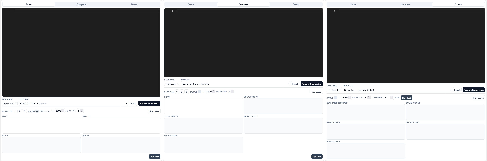

# AtCoder In-Browser Playground (AIBP)

[](https://github.com/AXT-Studio/AtCoder-InBrowser-Playground/releases/latest) [](https://chromewebstore.google.com/detail/atcoder-in-browser-playgr/peebgngcbbimicflmefcmbobenpfbnok) [](https://addons.mozilla.org/ja/firefox/addon/atcoder-in-browser-playground/)

AtCoderの問題ページに、ブラウザ上で動作が完結するコードエディター・テスターを追加するWeb拡張機能です。  
Web extension provides a code editor/tester for AtCoder, which can be completed in the browser.

- Supported Languages …… TypeScript, JavaScript, Python, Lua, Ruby, C++(Clang), Brainfuck, Text
- Supported Browsers …… Chromium-based or Firefox-based browsers

## License

copyright (c) 2026- **Ayasaka-Koto (AyaExpTech)**.  
This project is licensed under **the MIT License**. See the [LICENSE](./LICENSE) file for details.

## Install

- Chromium-based Browsers → [Chrome Web Store](https://chromewebstore.google.com/detail/atcoder-in-browser-playgr/peebgngcbbimicflmefcmbobenpfbnok)
- Firefox-based Browsers → [Firefox Add-ons](https://addons.mozilla.org/ja/firefox/addon/atcoder-in-browser-playground/)

---

## Features

1. **ブラウザ完結のコードテスト**
    - コードテストの実行はブラウザ内(Web Worker)で行われます
    - 外部の実行環境に依存しないため、安定したコードテストを行うことができます
2. **Monaco Editorによる高度なコード編集**
    - Visual Studio Codeで使用されているMonaco Editorを組み込んでいます
    - 一部言語では、Syntax HighlightやIntelliSenseなどの高度なコード編集機能を利用できます
3. **迅速な提出準備**
    - 編集したコードを問題ページ下部のソースコード入力欄に自動入力することができます
4. **複数言語への対応**
    - 複数のプログラミング言語に対応しています (後述)

### Why AIBP?

AtCoderのコンテストの参加者がコードを書く方法は、主に以下の2つが主流です。

1. AtCoderの「コードテスト」ページなどを利用する
    - 当該ページを開けば利用できるため、非常に手軽です
    - しかし、IDE(VSCodeなど)と比較すると機能が少なく、快適なコード編集環境ではないと感じる人も少なくはありません
2. [`oj`](https://github.com/online-judge-tools/oj)等の環境構築を行い、ローカルの開発環境を使用する
    - 使用するエディタが自由に選択でき、慣れれば提出までをスムーズに行えるでしょう
    - しかし、環境構築には手間がかかり、またCLIを扱いなど初心者にとってハードルの高い部分があります

AIBPは、これら2つの方法の「間」を埋めることを目的として誕生しました。
AIBPをあなたが使っているブラウザにインストールするだけで、AtCoderの問題ページを問題確認から提出までをより快適に行う環境に変えることができます。

## Quick Start Guide

> 
> (左から順に、"Solve"タブ・"Compare"タブ・"Stress"タブのスクリーンショット)

本拡張機能を導入した状態でAtCoderの問題ページを開くと、画像のようなUIをもつパネルが画面右側に追加されます。

- 各タブの共通事項
    - エディタのすぐ下にある欄で使用する言語を選択します
    - 言語によっては、言語選択欄のすぐ右にある選択欄で選んだテンプレートを挿入することができます
    - "Show Cases"ボタンを押すと、テストケースや実行結果を確認したり、手動でテストケースを入力してテストを実行したりできます
- **"Solve"タブ** —— 提出コードを書いて試す
    - このタブのエディタには、提出を想定したコードを書きます
    - "EXAMPLE"欄の各ボタンを押すと、問題文中の入出力例をもとにテストを実行します
    - "Prepare Submission"ボタンを押すと、エディタに書かれたコードを提出欄に入力します
        - 提出言語の選択は行われないため注意してください
- **"Compare"タブ** —— 提出コードと別のコードを比較する
    - このタブのエディタには、比較対象となる実装(愚直解法など)のコードを書きます
    - エディタの下部のテスト実行セクションでは、指定したテストケースについて2実装の出力を比較することができます
        - "Solve"タブと"Compare"タブのコードで出力結果を比較し、その結果を表示します
- **"Stress"タブ** —— ランダムテスト
    - このタブのエディタには、"Solve"タブと"Compare"タブのプログラムに与える入力をstdoutに出力するコードを書きます
    - エディタの下部のテスト実行セクションでは、ランダムテストを実行することができます
        - "Stress"タブのプログラムで生成したテストケースを"Solve"タブと"Compare"タブのプログラムに渡して比較し、その結果を表示します

## Supported Environment

この拡張機能は、以下の環境で動作することを想定しています。

> [!NOTE]
> このセクションでは、「保証(環境)」「期待(環境)」という表現を用います。これらはそれぞれ、以下を意味します。
>
> - 保証(環境)
>     - 当該環境は正式に動作環境として対応を行います
>     - もしバグ等で動作しない状態になっている場合、この拡張機能自体の保守が継続されている限り修正対応を行います
> - 期待(環境)
>     - 当該環境は、正式に対応はしていないものの、本拡張機能が動作することが期待できます
>     - ただし、バグなどで動作しなかったとしても、それらの修正に対応するとは限りません

- ブラウザ
    - 保証: Mozilla Firefox, Google Chrome (いずれも最新のStableリリース)
    - 期待: Firefoxベース、もしくはChromiumベースの各ブラウザ
- ウィンドウ幅
    - 保証: [`window.innerWidth`](https://developer.mozilla.org/ja/docs/Web/API/Window/innerWidth)が`1200`(px)以上
        - ウィンドウ幅が1200px未満の場合、AIBPのパネルは表示されません
        - ver2.3.1で、表示条件の下限が1400pxから緩和されました

## Supported Languages

この拡張機能の各機能は、以下の言語に対応しています。

|   Language | Code Exec. | Syntax Highlight | IntelliSense | Template |
| ---------: | :--------: | :--------------: | :----------: | :------: |
| TypeScript |     ✅️     |        ✅️        |      ✅️      |    ✅️    |
| JavaScript |     ✅️     |        ✅️        |      ✅️      |    ✅️    |
|     Python |     ✅️     |        ✅️        |      ❌️      |    ➖️    |
|        Lua |     ✅️     |        ✅️        |      ❌️      |    ✅️    |
|       Ruby |     ✅️     |        ✅️        |      ❌️      |    ➖️    |
| C++(Clang) |     ✅️     |        ✅️        |      ❌️      |    ✅️    |
|  Brainfuck |     ✅️     |        ✅️        |      ❌️      |    ➖️    |
|  Text(cat) |     ✅️     |        ➖️        |      ➖️      |    ➖️    |

なお、ブラウザ内で実行する都合上、ジャッジ環境とAIBPのテスト実行の間では多少なりとも環境の差異が生まれます。  
少なくともAtCoder Beginner Contestで使用する範囲については差異を吸収するよう努めますが、出力の完全な一致は保証されない点はご了承ください。

### JavaScript

- 想定ジャッジ: JavaScript (Bun 1.2.21), JavaScript (Deno 2.4.5), JavaScript (Node.js 22.19.0)
- AIBP側使用ランタイム: [QuickJS-NG](https://github.com/quickjs-ng/quickjs) + [Sucrase](https://github.com/alangpierce/sucrase)
- 制約
    - stdinは以下のいずれかの方法で受け付ける必要があります
        - `require("fs").readFileSync("/dev/stdin", "utf8")`
        - `await Deno.readTextFile("/dev/stdin")`
        - `await Bun.file("/dev/stdin").text()`
    - `console.log()`・`console.error()`以外の`console`オブジェクトのメソッドは、AIBP上では利用できません
    - 新しいメソッドやランタイム固有のメソッドは使用できません
        - 少なくともECMAScript 2025仕様に含まれるものはほとんど使えるはずなので、困ることはないと思います
    - エラーの文言はブラウザ内実行環境(QuickJS-NG)の出力をベースとした独自のもので、Node.js・Deno・Bunは一致しません
    - AtCoderジャッジ環境で使える各種ライブラリ(`data-structure-typed`, `immutable`, `lodash`, `mathjs`, `tstl`)は使えません
    - WebAssembly JavaScript APIの基本的な機能も利用できます(が、WebAssembly System Interfaceなどは使用できません)
    - 深い再帰が必要なコードは(コールスタックサイズの制限により)動作しないことがあります

### TypeScript

- 想定ジャッジ: TypeScript 5.8 (Deno 2.4.5), TypeScript 5.9 (tsc 5.9.2 (Bun 1.2.21)), TypeScript 5.9 (tsc 5.9.2 (Node.js 22.19.0))
- AIBP側使用ランタイム: [QuickJS-NG](https://github.com/quickjs-ng/quickjs) + [Sucrase](https://github.com/alangpierce/sucrase)
- 制約
    - JavaScriptとほぼ同様です。JavaScriptの記述を参照してください
    - コードテスト実行時に型検査は行われません
    - `namespace`構文は実行時に丸ごと削除されるため、型以外を含む`namespace`があると動作しないことがあります

### Python

- 想定ジャッジ: Python (CPython 3.13.7), Python (PyPy 3.11-v7.3.20)
    - "Python (Codon 0.19.3)"は非対応です
- AIBP側使用ランタイム: [Pyodide](https://github.com/pyodide/pyodide)
- 制約
    - 使用可能なパッケージは、以下に列挙するもののみとなります
        - `numpy`, `bitarray`, `sympy`, `mpmath`, `sortedcontainers`, `more_itertools`, `networkx`, `atcoder`(ac_library_python)

### Lua

- 想定ジャッジ: Lua (Lua 5.4.7)
    - "LuaJIT (LuaJIT 2.1.1703358377)"は非対応です
- AIBP側使用ランタイム: [wasmoon](https://github.com/ceifa/wasmoon)
- 制約
    - コードテストの実行環境(wasmoon)はLua 5.4.**5**なので、5.4.6・5.4.7の変更はAIBP内では反映されていません
    - stdinは`io.read`、stdoutは`print`・`io.write`、stderrは`io.stderr:write`を使用してください

### Ruby

- 想定ジャッジ: Ruby (CRuby 3.4.5)
    - "Ruby 3.3 (truffleruby 25.0.0)"は非対応です
- AIBP側使用ランタイム: [ruby.wasm](https://github.com/ruby/ruby.wasm)
- 制約
    - 使用可能なライブラリ(gem)は以下に列挙するもののみとなります
        - `ac-library-rb`, `bitarray`, `sorted_containers`, `rgl`, `faster_prime`
        - `rgl` の依存として `pairing_heap` と `stream` も入っています
    - stdinは`gets`・`$stdin`、stdoutは`puts`・`print`、stderrは`$stderr`を使用してください

### C++(Clang)

- 想定ジャッジ: C++23 (Clang 21.1.0)
    - "C++23 (GCC 15.2.0)"は非対応です
        - `libstdc++`などは使用できません
        - ただし、GCCでもClangでも動くコードはそこそこあるようです
- AIBP側使用ランタイム: Clang 21.1.0 (Emscripten上の自前wasmビルド)
- 制約
    - コンパイルに数秒かかることがあります。実行時間の計測とTLE判定はコンパイルを除いたユーザーコードの実行時間のみを対象にしています
    - `bits/stdc++.h`およびac-library(`#include <atcoder/dsu>`など)は使用できます
        - ただし、`bits`の`csetjmp`および`csignal`はWASI側の制約により使用できません
    - Boost、OR-Tools、OpenMP、`import std`などは使用できません
    - 例外(`throw`/`catch`)とRTTI(Run-Time Type Information)はOFFになっています
    - その他、ポインタの幅や`long double`の精度など、ジャッジの`x86_64`とは異なる部分があります

### Brainfuck

- 想定ジャッジ: Brainfuck (Tritium 1.2.73)
- AIBP側使用ランタイム: (自前実装)
- 制約
    - 1セル8bitモードです。つまり、255+1→0, 0-1→255になります
    - `,`命令処理時、すでに入力を末尾まで読んでいた場合に代入される値は-1(255)です
    - テープ量の上限や実行速度、細かいエラー、ASCII文字以外を入力した場合など、細かい挙動については保証されません

### Text

- 想定ジャッジ: Text (cat 9.4)
- AIBP側使用ランタイム: (自前実装)
    - 主に対応言語の追加方法の例示を目的として用意したものです
    - もっともシンプルなので、対応言語を追加したい場合はこれが参考になるでしょう

## Privacy Policy

本拡張機能は、AtCoderの問題ページ上でのコーディング支援を目的として動作し、ユーザーの個人情報の取得・送信は行いません。

1. 収集する情報
    - 本拡張機能は、AtCoder問題ページ(`https://atcoder.jp/contests/*/tasks/*`)からのみWebコンテンツを読み取ります。
        - 読み取る情報は、実行時間制限や入力例・出力例などの問題情報に限定されます。
    - 本拡張機能は、ユーザーが拡張機能UIで入力したコード・設定値を、ローカルの拡張機能ストレージに保存します。
        - このために、本拡張機能は`storage`権限を要求します。
2. 利用目的
    - 読み取った問題文情報は、テスト入力自動設定や実行制限の初期値反映など、本拡張機能が持つ機能のためにのみ利用します。
    - ローカル保存情報は、言語設定・コード自動保存の復元にのみ利用します。
3. 送信・共有について
    - 取得・保存した情報は外部サーバや第三者への共有・送信を行いません。
    - 個人情報の収集・保存は行っていません。
4. ユーザーの権利
    - ユーザーはブラウザの拡張機能設定からいつでも`LocalStorage`をクリアできます。

本ポリシーは、拡張機能の更新に応じて随時改善します。
本拡張機能に関するご質問・ご意見は、GitHubリポジトリのIssueや、開発者の連絡先までお知らせください。

- GitHubリポジトリ: [AXT-Studio/AtCoder-InBrowser-Playground](https://github.com/AXT-Studio/AtCoder-InBrowser-Playground)
- 開発者連絡先: `ayasaka.koto@axtech.dev`, [Twitter: @AXT_AyaKoto](https://x.com/AXT_AyaKoto)

## for Developers

- `package.json`登録のscripts一覧
    - 初回セットアップ
        ```sh
        pnpm install                    # Install Dependencies
        pnpm run postinstall            # (Auto: wxt prepare)
        ```
    - WebAssemblyモジュール群のEmscriptenビルド
        ```sh
        pnpm run build:engine:clang     # Clang 21.1.0, lld (wasm化、40分程度目安)
        pnpm run build:engine:qjs-wamr  # QuickJS, WAMR
        pnpm run build:engines          # 上記すべて (40分程度目安)
        ```
    - 開発サーバー
        ```sh
        pnpm run dev:chrome             # Chrome Dev Build (※コードテスト実行機能が動作しない Chrome検証時は要build)
        pnpm run dev:firefox            # Firefox Dev Build
        ```
    - テスト・チェック関連
        ```sh
        pnpm run test                   # Type Check -> Format -> Lint -> Unit Tests（= 全部まとめて）
        pnpm run test:unit              # Unit Tests (Vitest)
        pnpm run test:lint              # Lint (Oxlint)
        pnpm run test:fmt               # Format (Oxfmt)
        pnpm run test:type-check        # Type Check (tsc --noEmit)
        ```
    - 拡張機能本体をビルド
        ```sh
        pnpm run build:ext:chrome       # Chrome Production Build
        pnpm run build:ext:firefox      # Firefox Production Build
        pnpm run build:ext              # Chrome & Firefox Production Builds
        ```
    - 拡張機能の提出用ビルド(Zip化)
        ```sh
        pnpm run zip:chrome             # Chrome Production Build -> Zip
        pnpm run zip:firefox            # Firefox Production Build -> Zip
        pnpm run zip                    # Chrome & Firefox Production Builds -> Zip
        pnpm run zip:full               # テスト・エンジンビルドも含めた全自動zip (40分程度目安)
        ```
- 注意点
    - **`wxt.config.ts`の`version`フィールドにある拡張機能のバージョンをちゃんと編集すること！**
        - 同じバージョンのパッケージを提出したりして混同することがないように注意！
    - `pnpm run build:engine:qjs-wamr`について
        - Emscripten(`emcc`, `emcmake`), cmake, gitのPATHを通しておく必要があります
            - MacOSでは`brew install emscripten`を先にしておきましょう
    - `pnpm run build:engine:clang`について
        - Emscripten(`emcc`, `emcmake`), cmake, ninjaのPATHを通しておく必要があります
        - 時間がかかります。MacBook Air (M2)で36分かかりました
    - `pnpm run zip:full`について
        - `build:engines`も含めたビルドステップ全体を実行するため、実行には時間がかかります
        - `build:engines`相当が済んでいる場合は`:full`なしで実行すればよいです
- Firefox版開発・提出時の諸注意
    - 一時的なアドオンの読み込み: `about:debugging#/runtime/this-firefox`
    - AMO申請時 ビルド手順の伝達:
        ```txt
        Requires: Node.js, pnpm, git, cmake, ninja, Emscripten (emcc/emcmake on PATH)
        Build command: `pnpm install` (-> `pnpm approve-builds` ) -> `pnpm run build:engines` -> `pnpm run zip:firefox`
        ```
