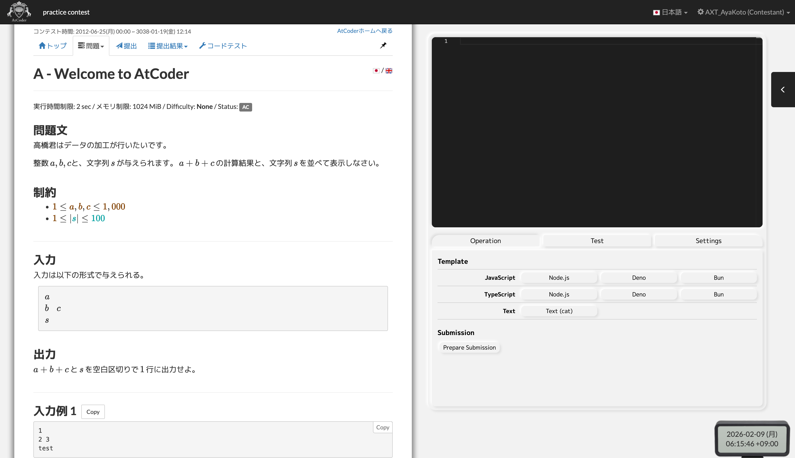
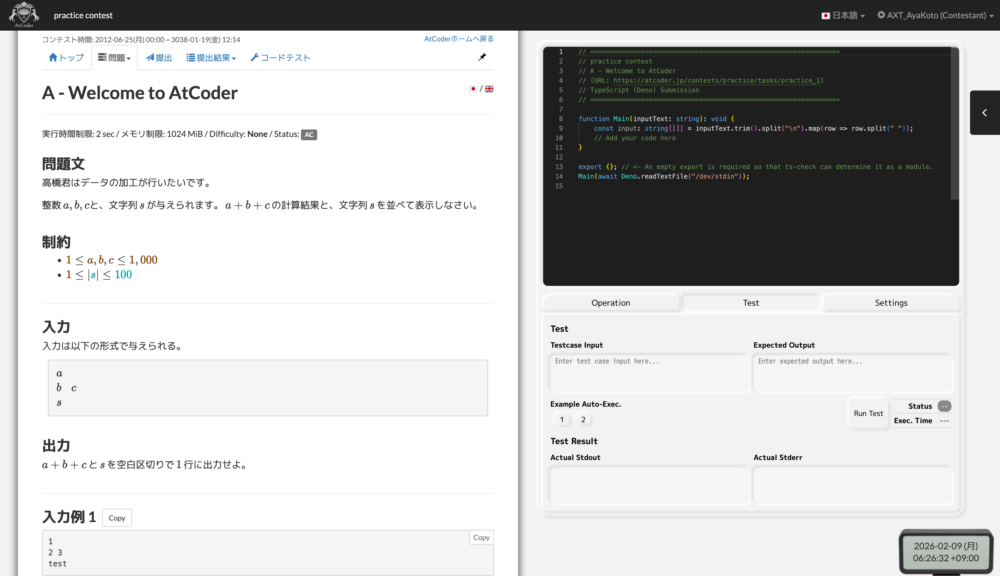
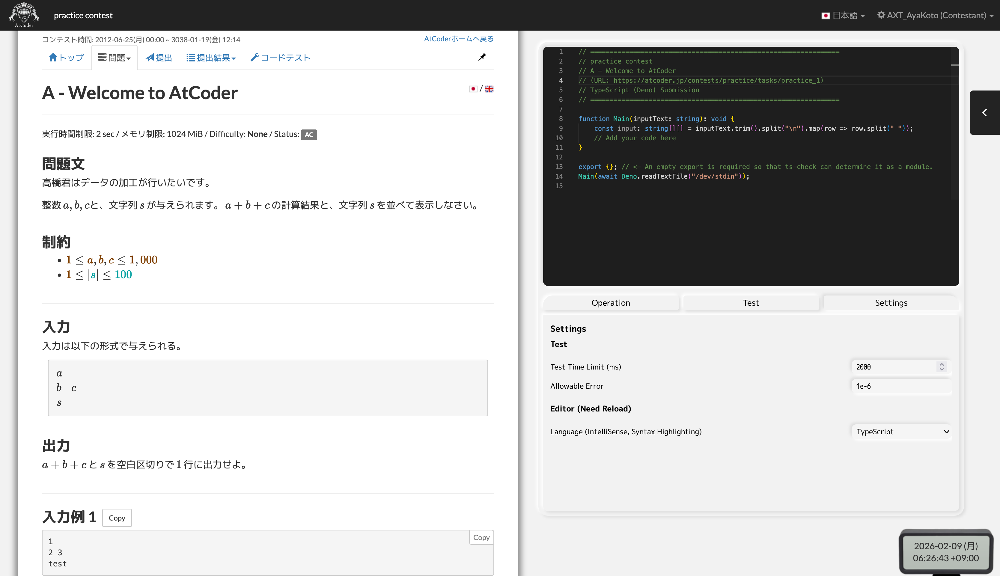

# AIBP User Guide

AIBPの使い方について説明します。

## インストール

AIBPは、以下のいずれかの方法でインストールできます。

### Chrome Web Store, Firefox Add-onsからインストール

- Chrome Web Store (準備中)
- Firefox Add-ons (準備中)

### ソースコードからインストール

GitHubリポジトリからソースコードをクローンし、`pnpm`が使える状態で以下のコマンドを実行することで、拡張機能をビルドできます。

```bash
cd extension
pnpm install
pnpm build # Chrome向けビルド
pnpm build:firefox # Firefox向けビルド
```

ビルド後、ブラウザの拡張機能管理画面から「パッケージ化されていない拡張機能を読み込む」(Chrome)または「アドオンを一時的に読み込む」(Firefox)を選択し、`extension/.output`フォルダにあるビルド成果物を指定してください。

## 各画面の説明

AtCoderの問題ページを開くと、問題文が左側に寄せられ、右側にAIBPのインターフェースが表示されます。

### Operationタブ



- **Template**: 入力受け取り用のテンプレートコードを挿入することができるボタン群です。
- **Submission > Prepare Submission**: 現在のコードを提出画面にコピーします。
    - ⚠️提出は手動で行う必要があります。

### Testタブ



- 入力
    - **Testcase Input**: テストケースの入力を記述するエリアです。
    - **Expected Output**: 期待される出力を記述するエリアです。
- 実行
    - **Run Test**: テストケースを実行し、出力結果を確認します。
    - **Example Auto-Exec.**: 問題文中の入出力例を自動で入力し、実行します。
- 結果表示
    - **Status**: テストケースの実行結果(AC, WA, TLE...)が表示されます。
    - **Exec. Time**: テストケースの実行時間が表示されます。
    - **Actual Stdout**: テストケースの実行結果(標準出力)が表示されます。
    - **Actual Stderr**: テストケースの実行結果(標準エラー出力)が表示されます。

### Settingsタブ



- Test
    - **Test Time Limit (ms)**: テストケースの実行時間制限をミリ秒単位で設定します。
        - 問題ページを開くたびに、問題文から制限時間を自動で取得して設定します。
    - **Allowable Error**: 浮動小数点数の誤差許容範囲を設定します。
        - 現在は固定で`1e-6`に設定されています。必要に応じて変更してください。
- Editor (Need Reload)
    - **Language**: 記述・実行するプログラミング言語を選択します。

